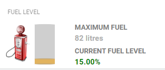

# Cumulocity IoT Silo Capacity widget

|   |      |  |
| ---------------------------------------------------- | ---- | ---------------------------------------------------- |
|                                                      |      |                                                      |
|  |      |  |

## Features
**Configurable cylinder:** Set the height, width, color and location of the cylinder in your widget

**Configurable volume calculation** Display remaining volume or fill volume

**Optional foreground image:** Upload and dynamically position a foreground image over the top of the cylinder

**Optional background image:** Upload and dynamically position a background image behind the cylinder 

**Configurable labels:** Add your own description labels for the levels

**Optional Thresholds:** Set high and medium thresholds with custom colors 

**Development debug mode:** Use the debug mode to check the cylinder range and to accurately position your images over the cylinder

## Installation

### Runtime Widget Deployment?

* This widget supports runtime deployment. Download the [Runtime Binary](https://github.com/SoftwareAG/cumulocity-silo-capacity-widget/releases/download/1.0.2/silo-capacity-widget_v1.0.2.zip) and follow runtime deployment instructions from [here](https://github.com/SoftwareAG/cumulocity-runtime-widget-loader).

## Userguide
This guide will teach you how to add the widget in your existing or new dashboard.

NOTE: This guide assumes that you have followed the [installation](https://github.com/SoftwareAG/cumulocity-runtime-widget-loader) instructions

1. Open the Application Builder application from the app switcher (Next to your username in the top right)
2. Add a new dashboard or navigate to an existing dashboard
3. Click `Add Widget`
4. Search for `Silo Capacity`
5. See below for the configuration options

### Configuration options

The widget configuration page contains a number of configuration attributes.

 - **Title** : Enter the title which will display at the top of your widget

   

 - **Target Assets or Devices** : Select your device

   

**Measurement Configuration** section

- **Measurement** : Select the measurement fragment and series from the dropdown
  
  
  
  **NOTE**: Once the **Target Assets or Devices** and **Measurement** information has been populated, you can click the 'Save' button to configure the widget with the default settings
  
   
  
- **Maximum fill level label** : Enter the label which will be displayed above the maximum fill level amount (note, if no label is entered, this section will not be displayed in the widget)

- **Maximum fill amount** : Enter the maximum fill amount for the device you have linked to this widget

- **Fill level unit** : Enter the fill level unit for the device which you have linked to this widget

- **Fill or remaining label** : Enter the label which will be displayed for the calculated fill or remaining volume (note, if no label is entered, this section will not be displayed in the widget)

- **Fill or remaining calculation** : The measurement percentage which is received can be used to calculate the remaining volume left in the cylinder or to calculate the amount of volume until the container is full  

- **Current fill percentage label** : Enter the label which will be displayed for the current measurement percentage (note, if no label is entered, this section will not be displayed in the widget)

- **Measurement is a percent or value** : Select whether the data being provided in the measurement is a percent or value

**Cylinder configuration** section

- **Height (px)** : Enter the height of the cylinder in pixels

- **Width (px)** : Enter the width of the cylinder in pixels

- **Left margin (px)** : To position the cylinder, enter the amount of pixels which should be padded on the left

- **Top margin (px)** :  To position the cylinder, enter the amount of pixels which should be padded at the top

- **Tilt height (px)** : The cylinder angle can be adjusted by amending the tilt height. Use this to adjust the cylinder to match the foreground and background image angle

- **Cylinder color (hex, rgb, rgba)** : Click on this field to select the color from the color palette. Alternatively, manually enter the hex value ( e.g. #d9ca1fff ), rgb value ( e.g. rgb(128, 255, 128) ), rgba value ( e.g. rgba(160, 160, 160, 0.5) ),  or the color string ( e.g. red, orange )

- **Cylinder fill color (hex, rgb, rgba)** : Click on this field to select the color from the color palette. Alternatively, manually enter the hex value ( e.g. #d9ca1fff ), rgb value ( e.g. rgb(128, 255, 128) ), rgba value ( e.g. rgba(160, 160, 160, 0.5) ),  or the color string ( e.g. red, orange )

  

**Foreground image configuration (optional)** section

- **Image file (png, jpeg, jpg)** : Click the button to select and upload a foreground image

- **Height (%)** : Enter the height in percent for the image

- **Left margin (px)** : To position the foreground image, enter the amount of pixels which should be padded on the left

- **Top margin (px)** : To position the foreground image, enter the amount of pixels which should be padded at the top

- **Show foreground image** : Once the foreground image has been uploaded and the image attributes have been entered, it is possible to hide the foreground by selecting this option

  
  

**Background image configuration (optional)** section

- **Image file (png, jpeg, jpg)** : Click the button to select and upload a background image

- **Height (%)** : Enter the height in percent for the image

- **Left margin (px)** : To position the background image, enter the amount of pixels which should be padded on the left 

- **Top margin (px)** : To position the background image, enter the amount of pixels which should be padded at the top

- **Show background image** : Once the background image has been uploaded and the image attributes have been entered, it is possible to hide the background by selecting this option

**Threshold configuration (optional)** section

- **High threshold range : Minimum value (%)** : Enter the minimum value for the high threshold range

- **High threshold range : Maximum value (%)** : Enter the maximum value for the high threshold range 

- **High threshold range : color (hex, rgb, rgba)** : Enter the hex value ( e.g. #d9ca1fff ), rgb value ( e.g. rgb(128, 255, 128) ), rgba value ( e.g. rgba(160, 160, 160, 0.5) ),  or the color string ( e.g. red, orange ) which will be used to set the label values and the cylinder color when the high threshold is breached

- **Medium threshold range : Minimum value (%)** : Enter the minimum value for the medium threshold range

- **Medium threshold range : Maximum value (%)** : Enter the maximum value for the medium threshold range

- **Medium threshold range : color (hex, rgb, rgba)** : Enter the hex value ( e.g. #d9ca1fff ), rgb value ( e.g. rgb(128, 255, 128) ), rgba value ( e.g. rgba(160, 160, 160, 0.5) ),  or the color string ( e.g. red, orange ) which will be used to set the label values and the cylinder color when the medium threshold is breached

- **Enable thresholds** : Once the threshold information has been entered, it is possible to disable the threshold processing by selecting this option

**Development (optional)** section

- **Enable debug mode** : The debug mode option allows the user to interact with the widget for development purposes.

  - Spin selector : In debug mode, the widget 'value' is replaced with a spin input and the measurement input from the device is disabled. Clicking in the spinner simulates the measurement input and causes the cylinder to calculate and display accordingly.
  
  - Foreground and background positioning: Debug mode can be used to assist in the fine tuning for the positions of the foreground and background images
    - Drag using the left mouse button : Drag the foreground and background images to temporarily view the position of the underlying cylinder.
    - Drag using the left mouse button **and the Ctrl key** : When the Ctrl key is pressed during the mouse drag, this automatically updates the foreground and background left margin and top margin. To save the position changes, edit the widget and click the save button
  
  
  

### Development - to enhance and test this widget in your local environment
1. Clone the repository on your local machine using `git clone https://github.com/SoftwareAG/cumulocity-silo-capacity-widget.git`.
2. Run `npm install` to download the module dependencies.
3. Run `c8ycli server -u https://your_tenant_url` to start the server.
4. Go to `http://localhost:9000/apps/cockpit/` in the browser to view and test your changes.
5. (Optional) push the changes back to this repository.

### Build - to create a new build of the silo-capacity widget for the Runtime Widget Loader
1. Finish the development and testing on your local machine.
2. Run `gulp` to start the build process.
3. Use the `silo-capacity-widget_vx.x.x.zip` file in the `dist` folder as your distribution file.

------------------------------

This widget is provided as-is and without warranty or support. They do not constitute part of the Software AG product suite. Users are free to use, fork and modify them, subject to the license agreement. While Software AG welcomes contributions, we cannot guarantee to include every contribution in the master project.
_____________________
For more information you can Ask a Question in the [TECHcommunity Forums](http://tech.forums.softwareag.com/techjforum/forums/list.page?product=cumulocity).

You can find additional information in the [Software AG TECHcommunity](http://techcommunity.softwareag.com/home/-/product/name/cumulocity).

